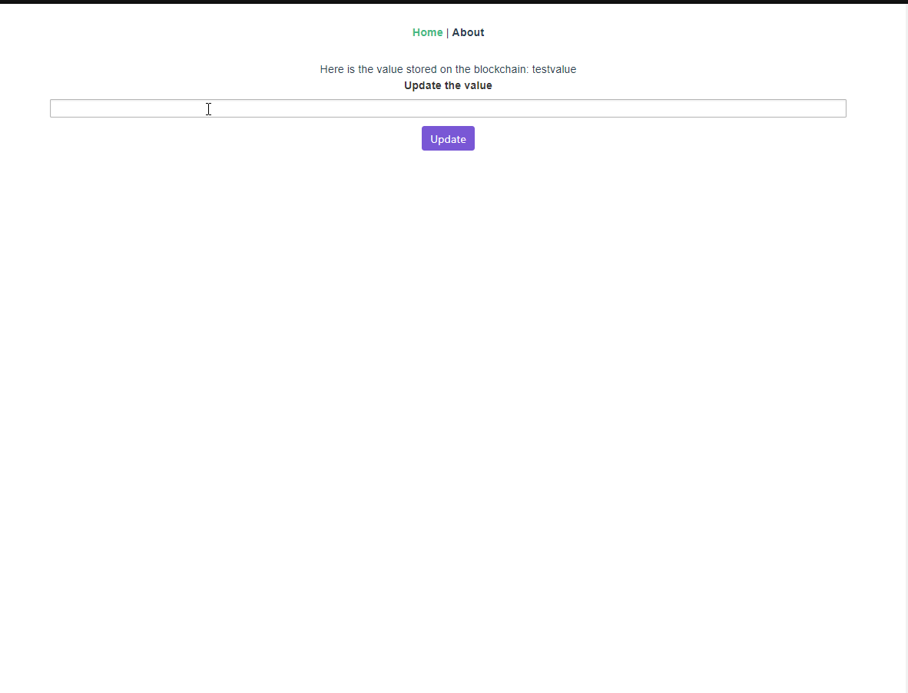

# vue-truffle-template

## Demo


## Build Setup
``` bash

# install truffle 
npm install -g truffle

#install dependencies
npm install

# build and deploy contract onto network
truffle compile
truffle migrate --network ropsten

# move to app and install dependencies
cd vue
npm install

# update the .env file in the root
MNEMONIC= "your ganache MNEMONIC"
INFURA_API_KEY="your infura key"

# update the .env file in application
VUE_APP_ETHADDRESS="your eth address"

# serve with hot reload at localhost:8080
npm run serve

# build for production with minification
npm run build

# build for production and view the bundle analyzer report
npm run build --report

# run unit tests
npm run unit

# run e2e tests
npm run e2e

# run all tests
npm test
```

